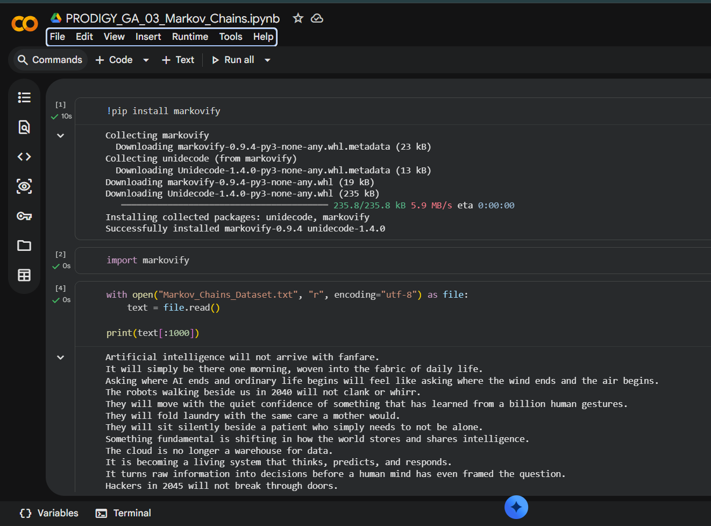
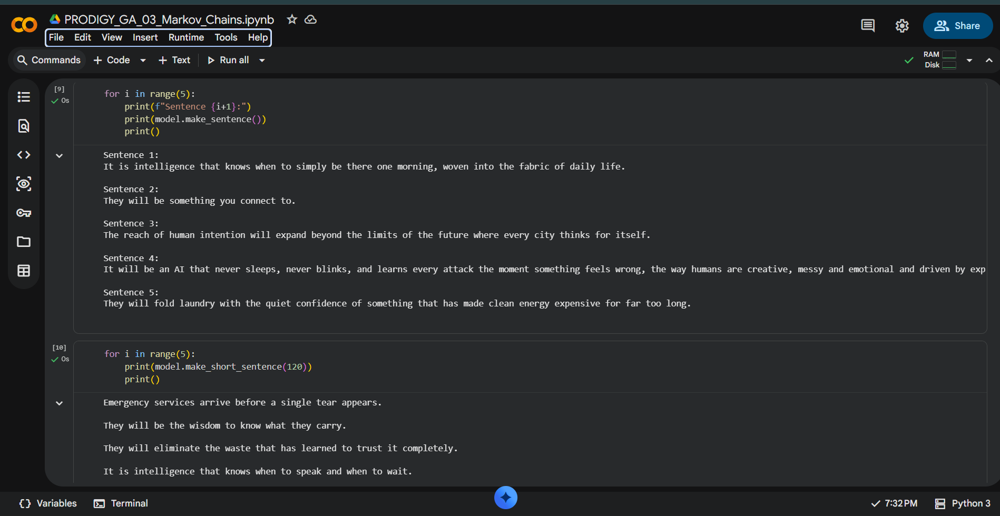
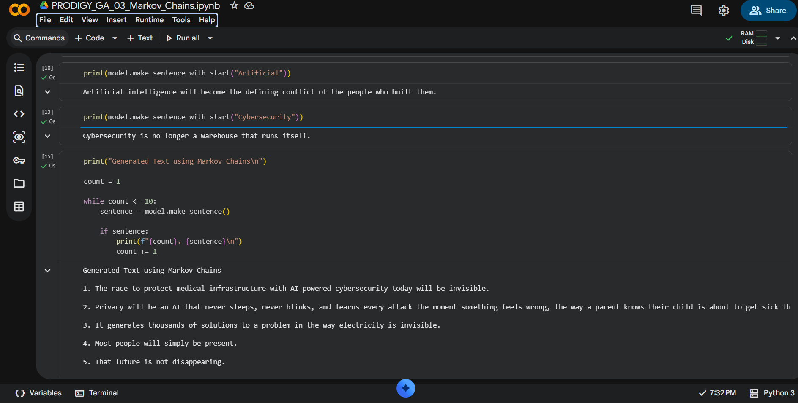

# Task 3: Text Generation with Markov Chains

## Generative AI Internship @ Prodigy InfoTech

### Project Overview

This project demonstrates text generation using **Markov Chains**, a statistical model that predicts the next word based on previously observed word sequences. Using the **Markovify** library, the model is trained on a custom technology-focused dataset and generates new sentences that resemble the writing style of the training data. This project highlights the fundamentals of probabilistic text generation and the capabilities of Markov Chain models.

### Objective

The objective of this project is to implement a simple text generation algorithm using Markov Chains. By analyzing statistical relationships between words in a training dataset, the model generates new text that resembles the writing style of the original content. This project demonstrates the fundamentals of predictive text generation and probabilistic language modeling without using deep learning techniques.

### Technologies Used

- **Python** – Core programming language used for implementation.
- **Google Colab** – Cloud-based development environment.
- **Markovify** – Python library for building Markov Chain text generation models.
- **UTF-8 Text Dataset** – Custom technology-focused dataset used for training.

### Project Workflow

```
Custom Text Dataset
          │
          ▼
Load Dataset into Python
          │
          ▼
Build Markov Chain Model using Markovify
          │
          ▼
Generate New Text
          │
          ▼
Evaluate Generated Sentences
```

### Implementation

The implementation was carried out in **Google Colab** using the **Markovify** library. The project includes dataset loading, model creation, text generation, and evaluation of generated sentences.

#### Dataset Loading



#### Sentence Generation



#### Advanced Text Generation

The model was also tested by generating sentences with specific starting words using `make_sentence_with_start()`.


